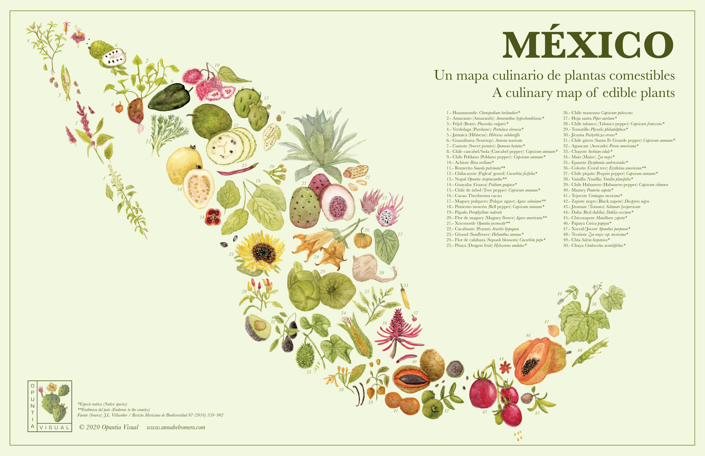
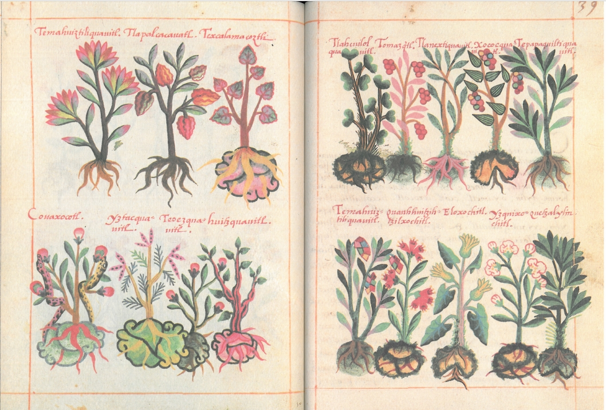
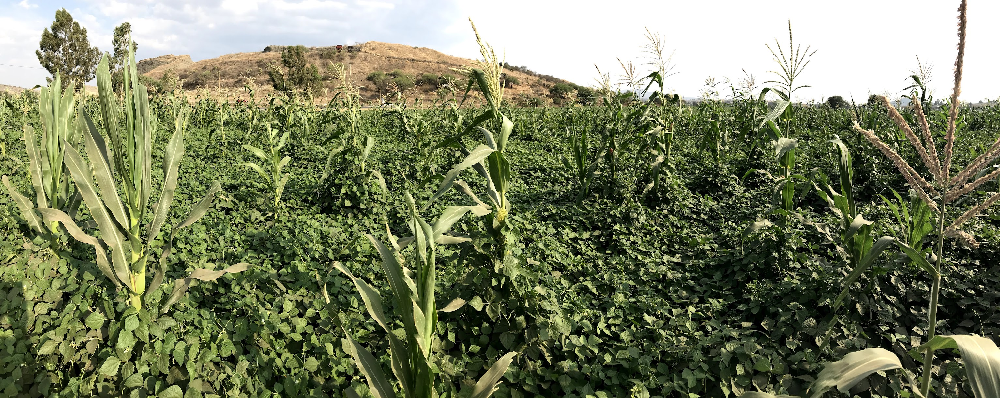
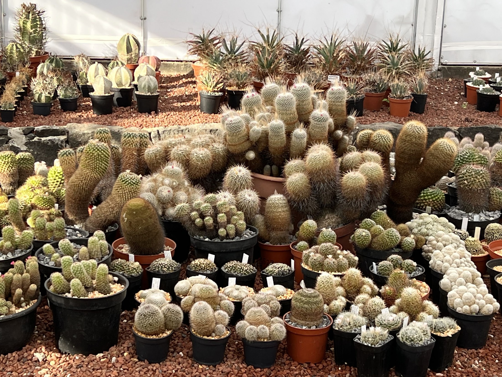
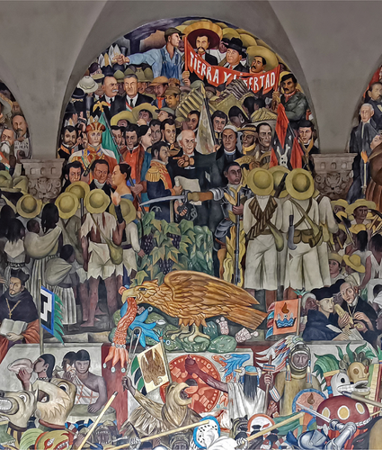

# Plants, People, and Science in Mexico
______________________

## Day 1: Introduction to Plants 🪴 and to Python 🐍

Figure legend: *México: Un mapa culinario de plantas comestibles*, A culinary map of edible plants, by Dr. Annabel Romero Hernandez. Reproduced with permission for this course. Website: [https://opuntiavisual.org/projects](https://opuntiavisual.org/projects)

**Assignment: Personal reflection on Mexico and your relationship to Mexican plants.**  
Submit a 2-3 page double-spaced essay or a 3-4 minute video that reflects on your relationship to a specific plant from Mexico. The plant may be native to Mexico or introduced, your association with the plant may have been within or outside of Mexico, or maybe you already have a strong connection to Mexico or none at all. If you are having difficulty choosing a plant from Mexico, please check out the illustrated work by Dr. Annabel Romero Hernandez, above (*México*: *Un mapa culinario de plantas comestibles*, A culinary map of edible plants). The plant you choose 1) should have a connection to Mexico and 2) you should be able to describe your relationship to it. In addition, you may choose to look up the Latin species name for your plant, the name of your plant in an Mexican Indigenous language (for example, Nahuatl, Yucatec Maya, Mixtec, Zapotec, Otomí, etc), describe its cultural uses in food, medicine, or textiles, or the larger ecological context of your plant, its relationship to other organisms and the ecosystem, or its domestication origins or current cultivation agriculturally. 

**Assignment: Download Anaconda and get going with Python and Jupyter notebooks.**  
You will be learning to find, analyze, interpret, and present quantitative data in this course. We will be using Python for this purpose. Before class, please watch the [introduction video](https://danchitwood.github.io/plants_and_python/). Then watch and work through the tutorial to download Anaconda, get going with Jupyter notebooks, write your first Python code, and the difference between coding and markdown cells: [Getting started | Empezando](https://danchitwood.github.io/plants_and_python/00_Installing_Anaconda/). 
_______________________

## Day 2: Plants and People: An introduction to Mexican plant biodiversity and Nahuatl  

Figure legend: From the De la Cruz-Badiano Codex (1552). Images from [Wikimedia](https://commons.wikimedia.org/wiki/File:Libellus_de_medicinalibus_Indorum_herbis_ff._38v-39r.jpg)

Many plants of the Americas retain names in Nahuatl, one of the most influential Indigenous languages of Mexico. If the plant is famous enough to have an emoji, then it is well-known enough that you should know its Nahuatl origins that endure in English and Spanish: 🥑*ahuacatl*/*aguacate*/avocado, 🍅*tomatl*/*tomate*/tomato, 🌶️*chilli*/*chile*/chilli, 🍫*chocolatl*/*chocolate*/chocolate, 🥜tlalcacahuatl/*cacahuate*/peanut, 🍠*camohtli*/*camote*/sweet potato, 🌽*elotl*/*elote*/maize. We will be reviewing one of the oldest, foundational scientific texts of the Americas, the De la Cruz-Badiano Codex of 1552. This illustrated work visualizes the plant diversity of Mexico and provides a linguistic taxonomy in a text that lays out the medicinal uses of plants. You will choose a number of plants from the Codex and be responsible for researching Nahuatl name, taxonomy, and possible candidates for their corresponding Latin species names. You will trace the morphological features of your illustrated plants—the leaves, fruits, flowers, and roots—and we will design a machine learning model to identify these features in the remainder of plant illustrations.

In Python, you will be learning about how to create variables, lists, and to index. For the in-class activity, we will be creating a taxonomy of the plants of Mexico you have chosen to study and exploring climate change using lists and indexing. 

**Read:**  
* [De Smedt and Cruz. 2025. Cosmovision as Cognitive Technology: The Case of Mesoamerican Medicinal Knowledge, *Topics in Cognitive Science*.](https://onlinelibrary.wiley.com/doi/full/10.1111/tops.70008)
* [García-Chávez JN, Vicente-Ferrer A, Tapia Bucio A, Ruíz-Amaro MJ, Hurtado-Olvera JJ, DeViller K, Simms L, Ayub Y, Lu Q, Plants&Python students, *et al.* 2026. Indigenous Plant Knowledge in the De la Cruz-Badiano Codex (1552): A Text Mining and Morphometric Study. *SocArXix, Open Science Framework*.](https://osf.io/preprints/socarxiv/dmb9k_v1)

**Explore:**  
[De la Cruz-Badiano Codex (1552)](https://danchitwood.github.io/DeLaCruzBadiano1552/)

*Plants&Python🪴🐍:*   
* 🇺🇸[Variables, Lists & Indexing](https://danchitwood.github.io/plants_and_python/1.0_Variables/) / 🇲🇽[Variables, listas y indexación](https://danchitwood.github.io/plants_and_python/ES_1.0_Variables/)
* 🇺🇸[Pre-class assignment](https://danchitwood.github.io/plants_and_python/1_practice/) / 🇲🇽[Tarea previa a la clase](https://danchitwood.github.io/plants_and_python/ES_1_practice/)
* 🇺🇸[In-class activity: Plants and Climate](https://danchitwood.github.io/plants_and_python/1_activity/) / 🇲🇽[Actividad en clase: Las plantas y el clima](https://danchitwood.github.io/plants_and_python/ES_1_activity/)
_____________________

## Day 3: Domestication and Mexico’s gift to the world: *Cintli* (maize), the *milpa*, and *las tres hermanas* 🌽🫘🎃

Figure legend: A *milpa* of maize and beans outside of Valle de Santiago, Guanajuato, México (photo: Dan Chitwood).

Maize, beans, squash, tomatoes, chiles, avocados, and agave. These are just some of the most important domesticated plants of the world that originate from the Americas. Some of these plants originate in Mexico and others travelled to Mexico from other parts of the Americas, but all were cultivated in Mexico before Conquest. We will learn about the centers of domestication in the Americas and how key crops traveled between peoples and were incorporated into their cultures. We will learn about agricultural ecosystems invented by Indigenous peoples, including *la milpa*, *las tres hermanas*, and Mixteca terraces / *metepantli*, and how these cultivation methods influenced the domestication and breeding of our favorite crops. We will discuss how these methods differ from monoculture and industrial agricultural, the origins of agricultural biodiversity, and how these methods point to a sustainable future.

In Python, you will be using matplotlib to learn about how to make plots and visualizations. In the in-class activity, you will learn to make plots and visualizations of leaf shapes and the spiral patterns of sunflowers and cacti.

**Read:**  
[Landon AJ. 2008. The” how” of the Three Sisters: The origins of agriculture in Mesoamerica and the human niche. *Nebraska Anthropologist*.](https://digitalcommons.unl.edu/nebanthro/40/)

Plants&Python🪴🐍:
* 🇺🇸[Visualizing data with matplotlib](https://danchitwood.github.io/plants_and_python/2.0_Modules/) / 🇲🇽[Visualización de gráficos con matplotlib](https://danchitwood.github.io/plants_and_python/ES_2.0_Modulos/)
* 🇺🇸[Pre-class assignment](https://danchitwood.github.io/plants_and_python/2_practice/) / 🇲🇽[Tarea previa a la clase](https://danchitwood.github.io/plants_and_python/ES_2_practice/)
* 🇺🇸[In-class activity: The shape of leaves and sunflowers](https://danchitwood.github.io/plants_and_python/2_activity/) / 🇲🇽[Actividad en clase: Las formas de las hojas y girasoles](https://danchitwood.github.io/plants_and_python/ES_2_activity/)
___________________________

## Day 4: Cactus and culture: Mexican identity, ecology, and conservation 🌵

Figure legend: Part of the cactus collection at the *Jardín Botánico del Instituto de Biología de la UNAM*](https://www.ib.unam.mx/ib/jb/).

**Read:**  
[Ramírez-Rodríguez Y *et al.*. 2020. Ethnobotanical, nutritional and medicinal properties of Mexican drylands Cactaceae fruits: Recent findings and research opportunities.](https://www.sciencedirect.com/science/article/pii/S0308814619322228)

The cactus is iconic to Mexico. It is the basis of the founding myth of *Tenochtitlan* (Mexico City) on the Mexican flag and part of national identity. We will learn about cactus diversity, domestication, their endangered status, and cultural uses, including *nopales*, *tunas*, *biznagas*, *garambullos*, *pitayas*, and *xoconostle*. We learn about research in one of the world’s most extensive cactus collections, [*Jardín Botánico del Instituto de Biología de la UNAM*](https://www.ib.unam.mx/ib/jb/), looking at the spiral patterns and development of cacti, related to the exercises in Python you will learn to reproduce this fascinating spiral pattern commonly seen in plants known as *phyllotaxy*, or the arrangement of plant organs.

In Python, you will learn about for loops and how to process data algorithmically. You learn how to calculate the golden angle from scratch using loops. Then in the in-class, you will use the golden angle and a loop to model the growing spiral patterns of sunflowers and cacti.

Plants&Python🪴🐍:
* 🇺🇸[Loops & the golden angle](https://danchitwood.github.io/plants_and_python/3.0_Range_Function/) / [Loops y el ángulo dorado](https://danchitwood.github.io/plants_and_python/ES_3.0_La_funcion_range/)
* 🇺🇸[Pre-class assignment](https://danchitwood.github.io/plants_and_python/3_practice/) / 🇲🇽[Tarea previa a la clase](https://danchitwood.github.io/plants_and_python/ES_3_practice/)
* 🇺🇸[In-class activity: How to Build a Sunflower](https://danchitwood.github.io/plants_and_python/3_activity/) / 🇲🇽[Actividad en clase: Cómo construir un girasol](https://danchitwood.github.io/plants_and_python/ES_3_activity/)
______________________________

## Day 5: Grapevines and independence: agriculture, labor, and immigration between the US and Mexico 🍇🇲🇽

  
Figure legend: Epopeya del pueblo mexicano (The History of Mexico). Diego Rivera (1935), Palacio Nacional, Mexico City, Mexico. From [Wikimedia](https://en.wikipedia.org/wiki/File:Epopeya_del_pueblo_mexicano.jpg)

The grapevine was introduced to Mexico, but had a disproportionately large impact on its development as a nation, and ultimately influenced questions about immigration and human rights beyond its borders to the US and the world. From the beginning of colonization with Cortés, Indigenous peoples were forced to plant the vine, and when they were successful, Spain prohibited wine production. This led Miguel Hidalgo to teach the poor viticulture, and shortly after the Spanish burned his teaching vineyards to the ground, he initiated Mexican independence with el grito (“the cry”). Later, Dolores Huerta would initiate the Delano grape strike which was the beginning of the United Farmworkers, which continues to this day to fight for the rights of the undocumented farmworkers that sustain the agricultural economy of the United States. 

In Python, you will learn to read in large datasets, analyze them, and make compelling plots with Seaborn using Pandas 🐼. For the in-class activity, you will analyze a dataset recording grape harvest dates over centuries and visualize the effects of climate change.

Read: [Chitwood DH *et al.*. 2024. *Sí se puede*: The enduring legacy of Mexico on wine and politics. *Plants, People, Planet*](https://nph.onlinelibrary.wiley.com/doi/full/10.1002/ppp3.10597)

**Explore:**    
[Who is a farmer?](https://danchitwood.github.io/who_is_a_farmer/)

Plants&Python🪴🐍:
* 🇺🇸[Data analysis with Pandas](https://danchitwood.github.io/plants_and_python/4.0_Reading_in_Data/) / 🇲🇽[Análisis de datos con pandas](https://danchitwood.github.io/plants_and_python/ES_4.0_Leyendo_en_data/)
* 🇺🇸[Pre-class assignment](https://danchitwood.github.io/plants_and_python/4_practice/) / 🇲🇽[Tarea previa a la clase](https://danchitwood.github.io/plants_and_python/ES_4_practice/)
* 🇺🇸[In-class activity: Grapes in a Warming World](https://danchitwood.github.io/plants_and_python/4_activity/) / 🇲🇽[Actividad en clase: Vides en un mundo que se calienta](https://danchitwood.github.io/plants_and_python/ES_4_activity/)

